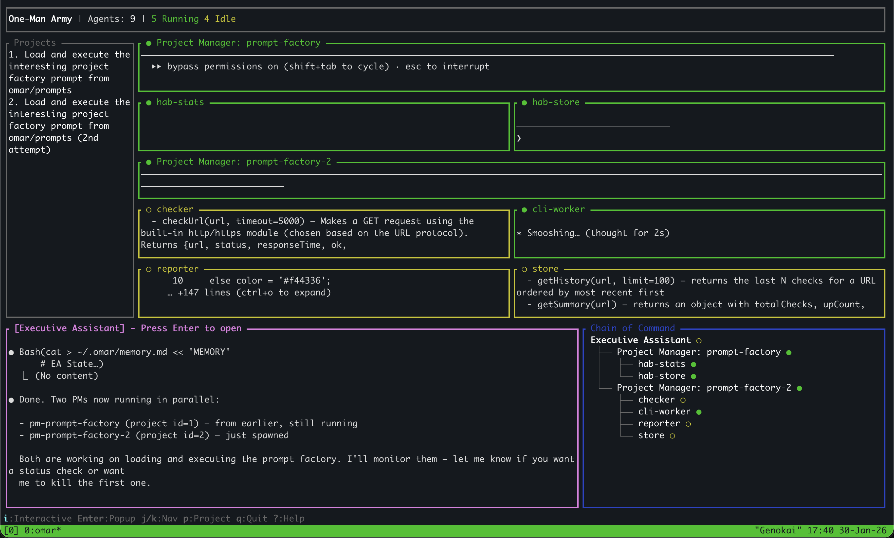

<div align="center">

# one-man army


Be a one-man army with non-stop agents tackling the biggest problems.

**`omar` is a TUI dashboard for managing AI agents based on `tmux`.**

<p>
  <a href="https://opensource.org/licenses/BSD-2-Clause">
    
  </a>
  <a href="https://github.com/lsk567/omar/actions/workflows/ci.yml">
    
  </a>
  <a href="https://discord.gg/X76PSzmfWr">
    
  </a>
</p>

</div>


## Features

- A TUI dashboard for all your agents in one place
- Spawn workers in parallel
- An executive assistant that manages agents for you
- Visualize a chain of command
- Health status tracking
- Easily talk to each agent via tmux popups
- Support all the familiar `tmux` commands you love



## Requirements

- tmux 3.0+
- Rust 1.70+
- At least one agent backend (claude, opencode, or custom)

## Installation

```bash
cargo install --path .
```

## Usage

### Dashboard Mode

```bash
omar
```

### Keyboard Shortcuts

| Key | Action |
|-----|--------|
| `q` / `Esc` | Quit |
| `j` / `Down` | Move down |
| `k` / `Up` | Move up |
| `Enter` | Attach to agent |
| `i` | Interactive mode (type directly to agent) |
| `n` | Spawn new agent |
| `d` | Kill agent |
| `r` | Refresh |
| `?` | Help |

## Supported Agent Backends

Omar auto-detects which agent backend is available on your system:

| Backend | Command | Auto-detected |
|---------|---------|---------------|
| [Claude Code](https://docs.anthropic.com/en/docs/agents-and-tools/claude-code/overview) | `claude --dangerously-skip-permissions` | Yes (first priority) |
| [Opencode](https://github.com/nichochar/opencode) | `opencode` | Yes (second priority) |
| Custom | Any command | Via config |

If both are installed, `claude` takes priority. Override with the `default_command` config option.

## Sandbox Mode (Docker)

Omar can optionally run worker agents inside Docker containers to isolate them from the host system. This protects against prompt-injection attacks where a malicious repository tricks the LLM into executing harmful commands.

Enable it in `~/.config/omar/config.toml`:

```toml
[sandbox]
enabled = true
image = "ubuntu:22.04"
network = "bridge"        # "bridge" (default), "none", or "host"

[sandbox.limits]
memory = "4g"
cpus = 2.0
pids_limit = 256

[sandbox.filesystem]
workspace_access = "rw"
bind_mounts = []          # extra host paths, e.g. ["/opt/tools:/opt/tools:ro"]
```

When enabled, worker agents run with:
- Dropped capabilities (`--cap-drop ALL`, `--security-opt no-new-privileges`)
- Read-only root filesystem with writable `/tmp`
- Configurable memory, CPU, and PID limits
- Workspace mounted at `/workspace`
- Agent binary and config auto-detected and mounted read-only
- Configurable network mode (default `bridge`; set `none` to block all network)

EA and PM agents are **not** sandboxed (they orchestrate via the API and don't touch untrusted code).

## License

MIT

## Star History

[](https://www.star-history.com/#lsk567/omar&type=date&legend=top-left)