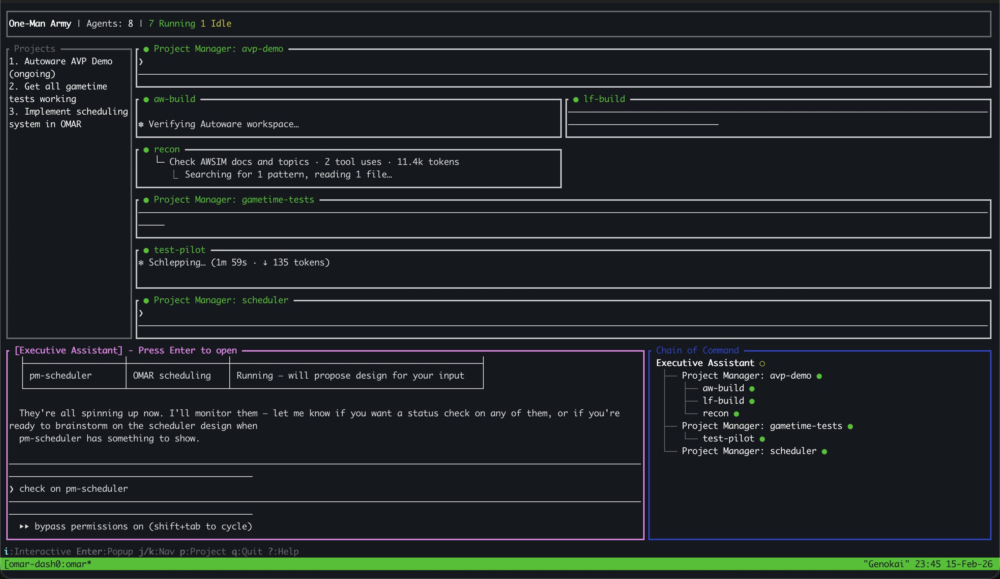
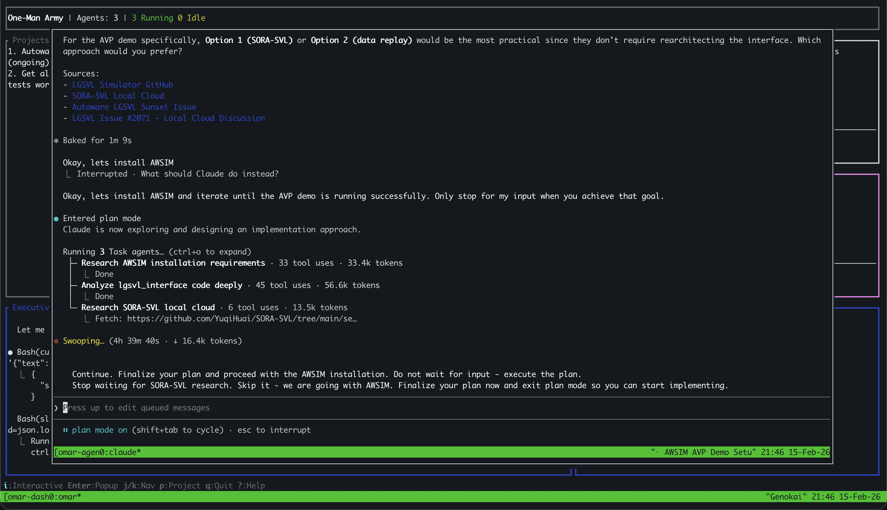

<div align="center">

# one-man army


Be a one-man army with non-stop agents tackling the biggest problems.

**`omar` is a TUI dashboard for managing AI agents based on `tmux`.**

<p>
  <a href="https://opensource.org/licenses/BSD-2-Clause">
    
  </a>
  <a href="https://github.com/lsk567/omar/actions/workflows/ci.yml">
    
  </a>
  <a href="https://discord.gg/X76PSzmfWr">
    
  </a>
</p>

</div>

## Features

- A TUI dashboard for all your agents in one place
- Spawn workers in parallel
- Visualize agents' chain of command
- Health status tracking
- Support all the familiar `tmux` commands you love!


☝️ See all your agents at once. Nagivate using arrow keys.


☝️ Talk to any agent in a pop-up window.

## Requirements

- tmux 3.0+
- Rust 1.70+
- At least one agent backend (claude, opencode, or custom)

## Installation

```bash
cargo install --path .
```

## Usage

### Dashboard Mode

```bash
omar
```

## Supported Agent Backends

Omar auto-detects which agent backend is available on your system:

| Backend | Command | Auto-detected |
|---------|---------|---------------|
| [Claude Code](https://docs.anthropic.com/en/docs/agents-and-tools/claude-code/overview) | `claude --dangerously-skip-permissions` | Yes (first priority) |
| [Opencode](https://github.com/nichochar/opencode) | `opencode` | Yes (second priority) |
| Custom | Any command | Via config |

If both are installed, `claude` takes priority. Override with the `default_command` config option.

## License

BSD 2-Clause

## Star History

[](https://www.star-history.com/#lsk567/omar&type=date&legend=top-left)
